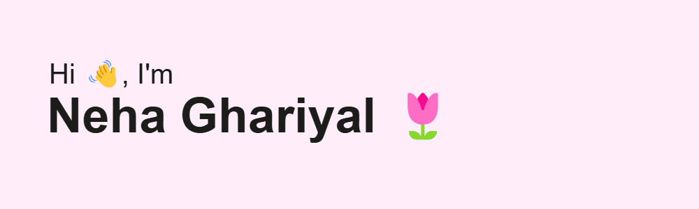

 

  

  

- ⚡ Motto - **(Muscle Memory + Logic) × Curiosity**

- 🌿 I'm currently working on something cool ✨

- 🔖 I'm currently learning **Backend and Blockchain**

- 💬 You can ask me anything about **React, Node and MongoDB**
  
- 🤝 I’m looking to collaborate on **Backend projects**

- 📫 How to reach me **nehaghariyal19@gmail.com**

 

<table>
  <tr>
    <td></td>
    <td></td>
  </tr>
</table>

 

<h3 align="left">Languages and Tools:</h3>

 
  
  
   
   
  
  
   
  
   
   
  
  
   
   
   
   
   
   
    

 

<h3 align="left">Connect with me:</h3>

 

